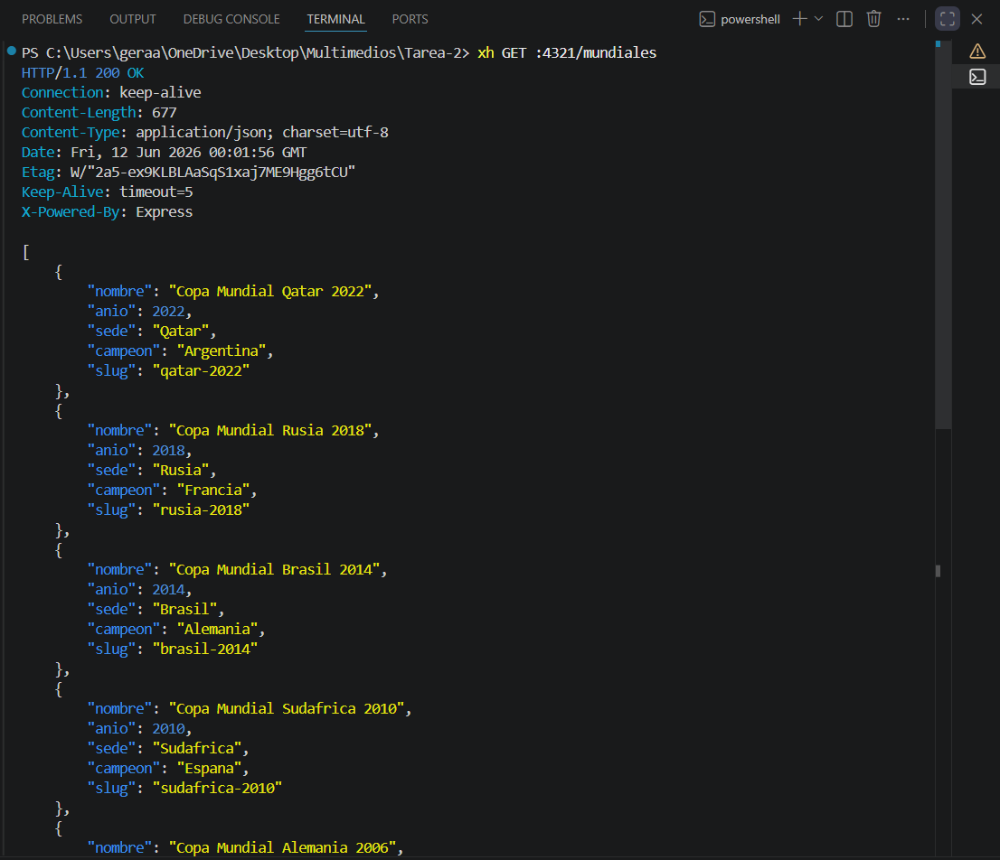
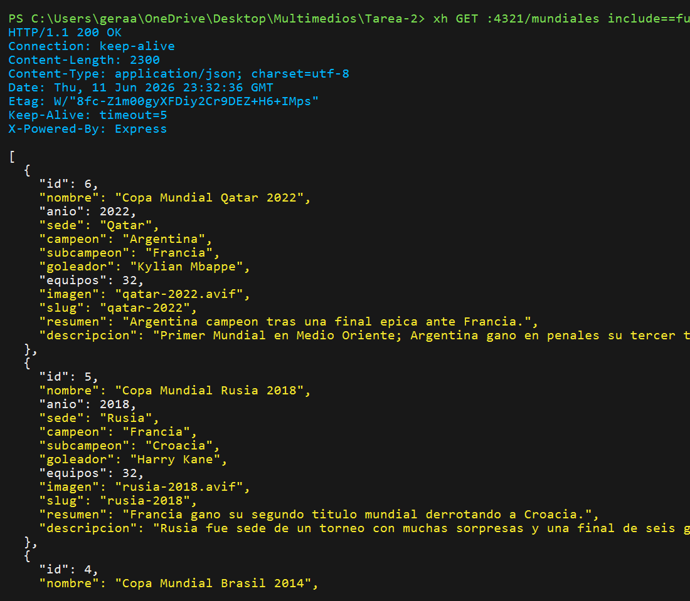
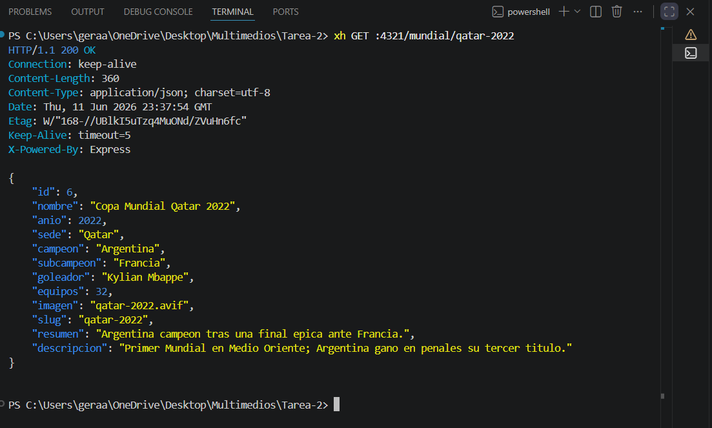
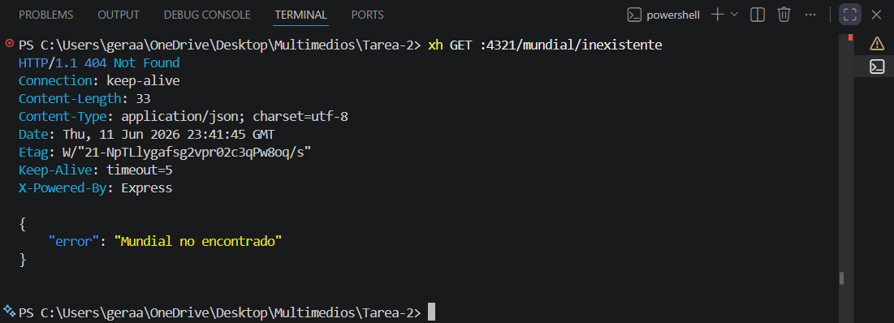
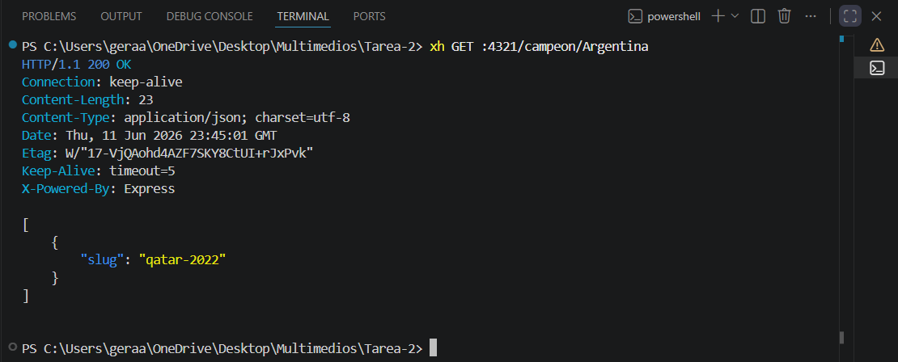
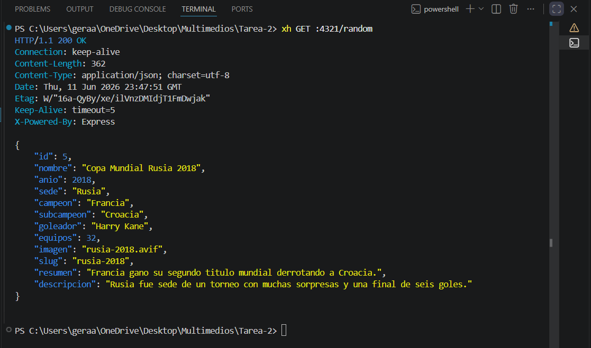
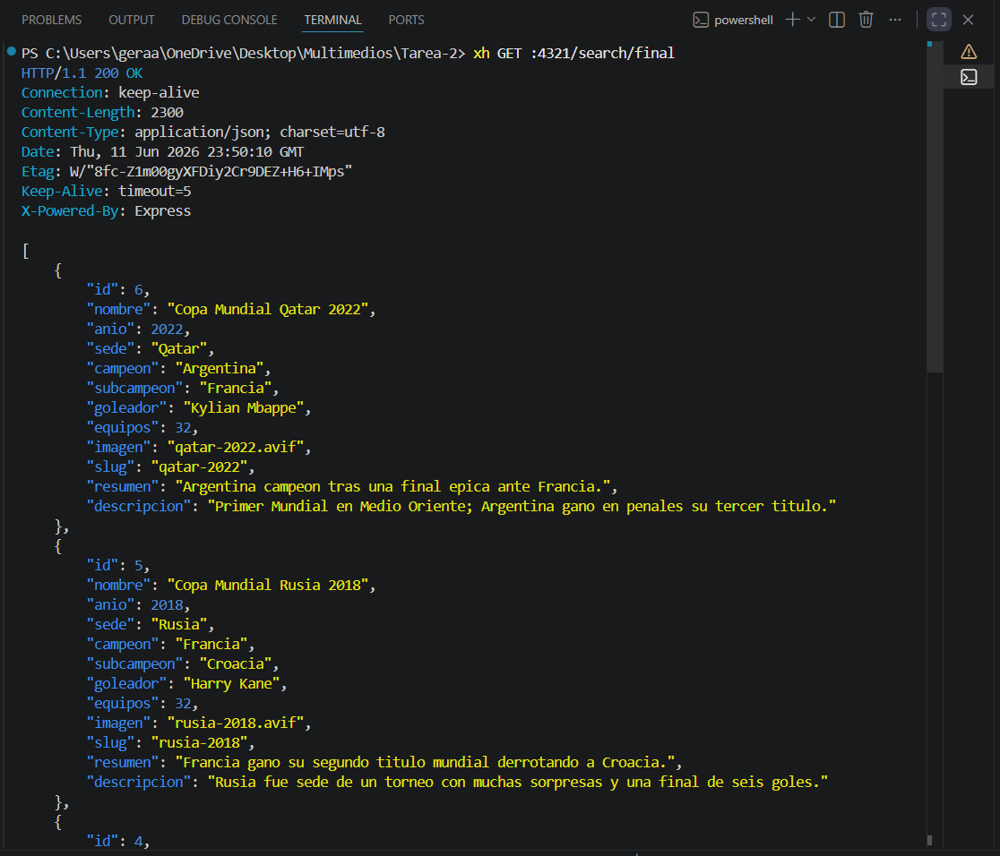
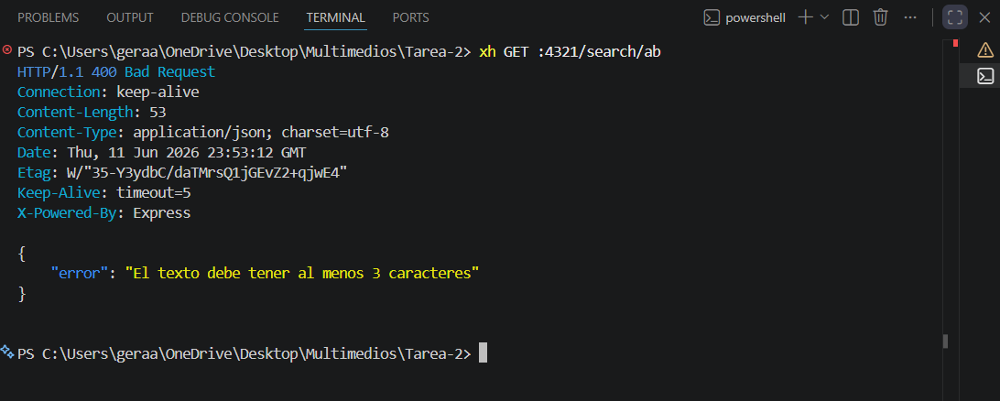

# Tarea-2

API REST creada con Node.js, Express, SQLite y Zod. Permite consultar informacion sobre varias ediciones de la Copa Mundial de la FIFA.

## Instalacion

```bash
npm install
```

## Poblar la base de datos

```bash
node database/seed.js
```

Este comando crea el archivo `database/database.sqlite` y carga los datos desde `src/data.sql`.

## Ejecutar el servidor

Modo desarrollo:

```bash
npm run dev
```

El servidor usa el puerto `4321`.

## Rutas

- `GET /`
- `GET /mundiales`
- `GET /mundiales?include=full`
- `GET /mundial/:slug`
- `GET /campeon/:pais`
- `GET /random`
- `GET /search/:text`
- `GET /imagenes/*`

## Pruebas con xh

```bash
xh GET :4321/mundiales
xh GET :4321/mundiales include==full
xh GET :4321/mundial/qatar-2022
xh GET :4321/mundial/inexistente
xh GET :4321/campeon/Argentina
xh GET :4321/random
xh GET :4321/search/final
xh GET :4321/search/ab
```

### Captura: GET /mundiales

Comando usado:

```bash
xh GET :4321/mundiales
```



### Captura: GET /mundiales include full

Comando usado:

```bash
xh GET :4321/mundiales include==full
```



### Captura: GET /mundial qatar

Comando usado:

```bash
xh GET :4321/mundial/qatar-2022
```



### Captura: GET /mundial inexistente

Comando usado:

```bash
xh GET :4321/mundial/inexistente
```



### Captura: GET /campeon argentina 

Comando usado:

```bash
xh GET :4321/campeon/Argentina
```



### Captura: GET /random

Comando usado:

```bash
xh GET :4321/random
```



### Captura: GET /search final

Comando usado:

```bash
xh GET :4321/search/final
```



### Captura: GET /search ab

Comando usado:

```bash
xh GET :4321/search/ab
```


